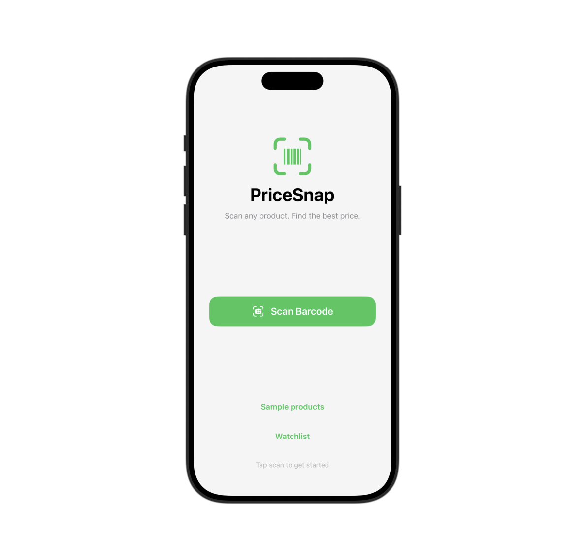
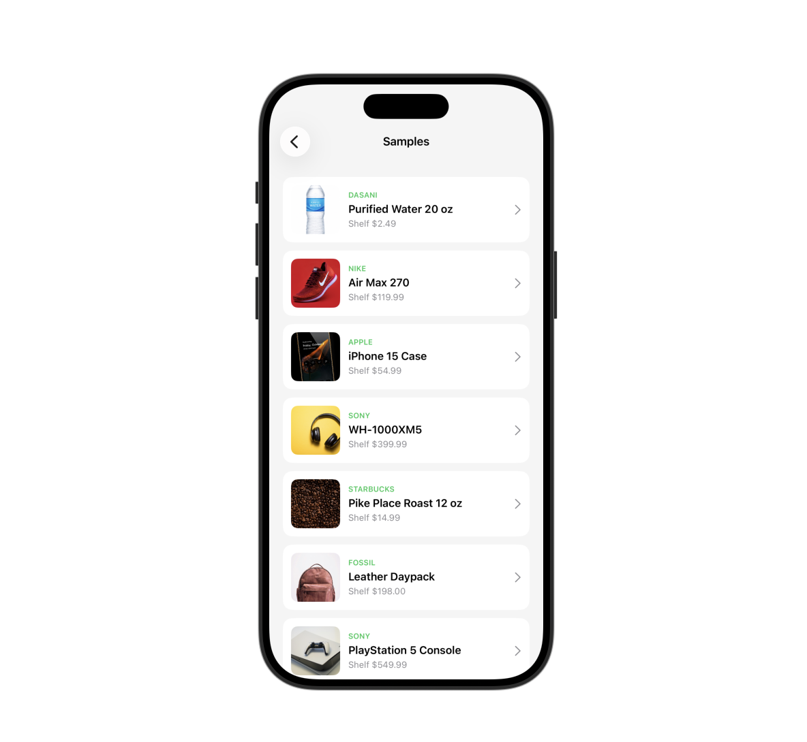
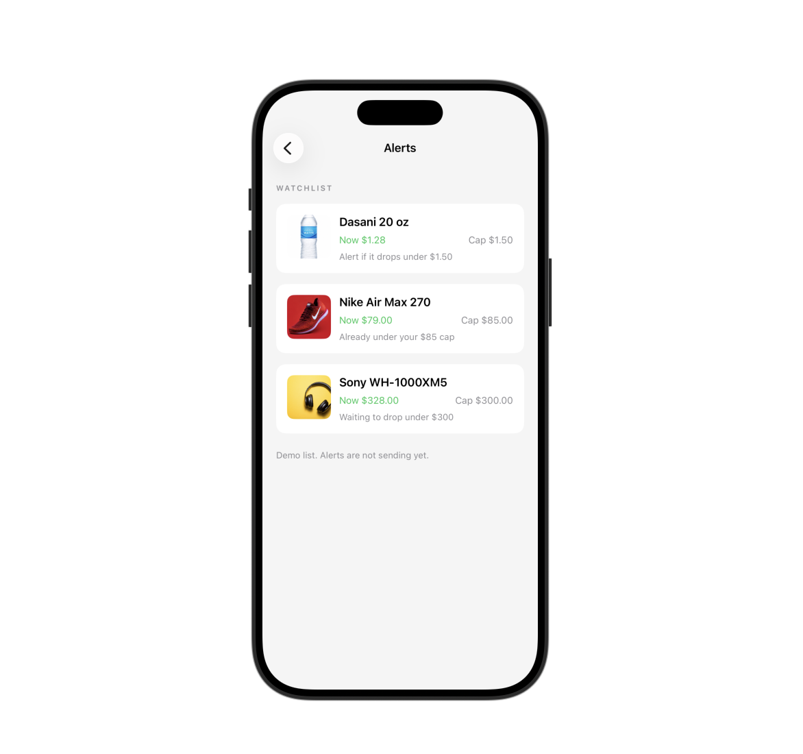
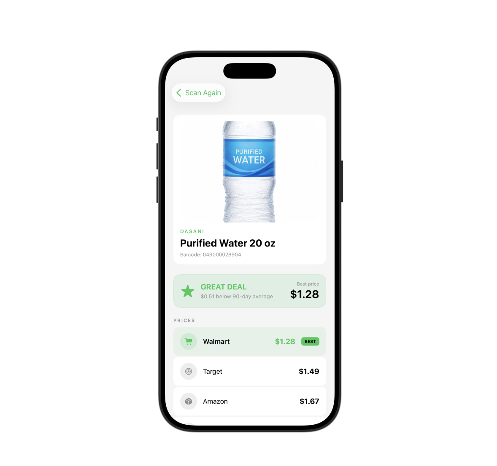
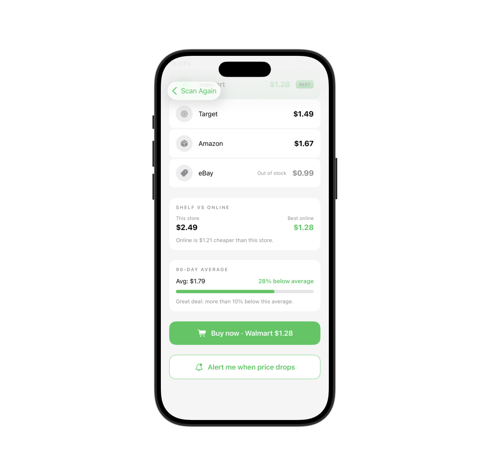

https://github.com/user-attachments/assets/921dcb39-b0ab-42d9-932b-569bd175b9d9

# PriceSnap
### Scan a shelf barcode, check if the same product is cheaper online, buy it there if it is


## Project Overview

You are in a store. You pick up a product. Before you pay the shelf price, you scan the barcode.

PriceSnap looks up that barcode and shows online prices from Amazon, Walmart, Target, eBay, and Best Buy. If an in-stock listing is cheaper than buying it in front of you, you order it there instead.

That is the whole product: save money at the shelf. If you tap through to a retailer, the long-term plan is an affiliate link so the app can take a commission. That checkout link is not wired in this version.

I built it as two pieces. The iPhone app scans the barcode and shows the result. A TypeScript API owns ranking: in-stock first, then cheapest price, then a deal score against a 90-day average. The phone does not invent prices.

This build uses sample retailer data. Live store feeds need API keys and break often. The scan → lookup → rank → UI path is real. Replacing the sample table later should not require new iOS models.

## Demo

<video src="
https://github.com/user-attachments/assets/d02a4dbe-51c4-4dc8-9d50-341ac2f921bc
"
       controls="controls"
       autoplay="autoplay"
       muted="muted"
       loop="loop"
       style="max-width: 100%;">
  Your browser does not support the video tag.
</video>

<p align="center">
  
</p>
<p align="center">
  
</p>
<p align="center">
  
</p>
<p align="center">
  
</p>
<p align="center">
  
</p>

## Software Architecture

The flow is split the same way the ZED tracker was: input, lookup, ranking, then UI. Dashed box is not built yet.

<p align="center">
  
</p>

```text
in-store scan (AVFoundation)
        ↓
   barcode
        ↓
GET /products/:barcode
        ↓
Zod: barcode is 8–14 digits
        ↓
sample offers (Amazon, Walmart, Target, eBay, Best Buy)
        ↓
comparison.ts
  ignore out-of-stock as "best"
  cheapest available price
  deal score vs 90-day average
        ↓
ResultView (buy online if it is cheaper)
```

```text
PriceSnap/
├── PriceSnap/           SwiftUI app
├── PriceSnap.xcodeproj
└── pricesnap-api/
    ├── src/types.ts
    ├── src/mockData.ts
    ├── src/comparison.ts
    ├── src/routes/products.ts
    └── src/server.ts
```

## Deal Score

Best price means cheapest **in stock**. Out-of-stock rows still show. They cannot win.

| Score | Rule |
|---|---|
| `great` | more than 10% below the 90-day average |
| `good` | below average, 10% or less |
| `fair` | at average |
| `overpriced` | above average |

## Technical Stack

**Client:** Swift, SwiftUI, AVFoundation (EAN-13, EAN-8, UPC-E, QR, Code 128)

**API:** TypeScript, Fastify, Zod, Vitest, Docker

## Setup

### API

```bash
cd pricesnap-api
npm install
npm run dev
```

- `GET /health`
- `GET /products/0194252914687`

```bash
npm test
```

Unknown scans fall through to Dasani water (`049000028904`). Nike: `0194252914687`. Full catalog: `GET /products`.

### iOS

1. Open `PriceSnap.xcodeproj`.
2. Leave the API on port 3000.
3. Simulator works with `http://localhost:3000`.
4. Real camera needs a phone. On device, point the app at your Mac's Wi-Fi IP, not localhost.
